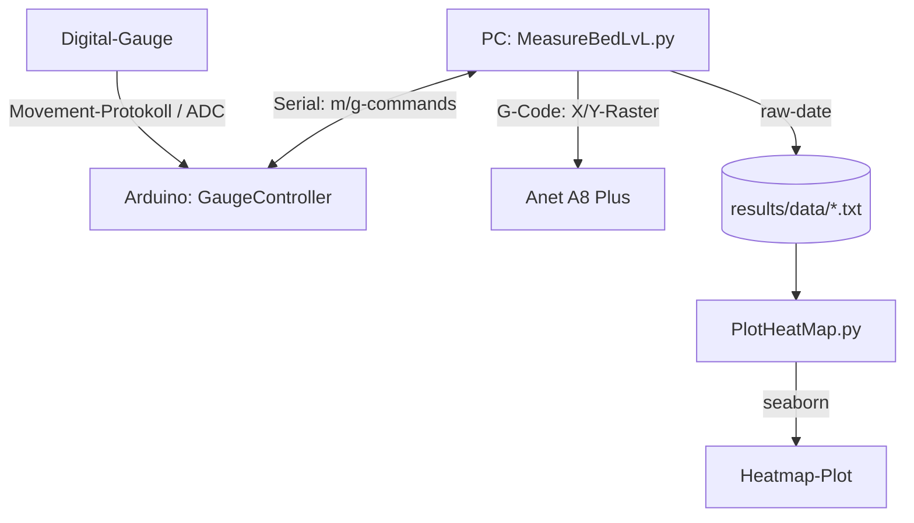

# Anet A8 Plus – Heatbed Level Measurement

An auutomated bed level mesh generator and heatmap plotter tested with the Anet A8 Plus using an Arduino-connected digital dial indicator.

I used a cheap digital indicator fixed on the toolhead reads bed height. A python scripts is used to command the printer to probe a grid via G-code, collect raw data from the gauge over serial and render heatmaps using `seaborn`.

## Architecture & Workflow

1. **Firmware** (firmware/GaugeController): Arduino sketch reading clock/data signals from a digital dial gauge. Signal decoding (getRawBit() / getRawData()) is adapted from work by Paweł Stawicki. Features a simple serial protocol (m = sample, g = get last reading) and displays measurements on an I2C LCD.
2. **`python/Printer.py`**: G-code and serial connection and motion commands for Anet A8 Plus.
3. **`python/Gauge.py`**: Serial wrapper for Arduino and digital-gauge controller with retry logic.
4. **`python/MeasureBedLvL.py`**: Main script. Executes X/Y grid sweep, samples data and logs to `results/data/<timestamp>.txt`.
5. **`python/PlotHeatMap.py`**: Output files parser and heatmaps render (matplotlib/seaborn).
6. **`python/AdjustBedLeveling.py`**: Utility for live height polling during heatbed-screw adjustments.

## Alternative: Octave/MATLAB Prototype

I actually started out in Octave (`octave/`) before moving everything over to Python. Back then, a single regex script (ParseMeasurementFile.m) handled the file parsing for both a 3D surface plot (`PlotResults.m`) and an interpolated 2D heatmap (`heatMap.m`). It worked fine, but we retired the whole setup once the seaborn pipeline took over. The main win was automation, with Python, I could just launch the job, walk away, and come back to finished visual outputs instead of manually pulling data through Octave every time.

## Results

Iterative leveling progress using generated heatmaps.

Initial unlevel bed (~0.5 mm variance across corners):

Mid-adjustment (front-left / rear-right bed screws):

Final result (~0.1–0.2 mm variance across bed):

Raw log files available in `results/data/`.

## Hardware

* Anet A8 Plus (3D printer controlled over USB serial)
* Arduino (Uno/Nano) with 20x4 I2C LCD
* Digital dial indicator with data port

## Configuration / Known Issues

Serial ports are hardcoded in source files:
* `Printer.py`: `COM7`
* `Gauge.py` / `MeasureBedLvL.py`: `COM4`

Update port assignments before running scripts.
